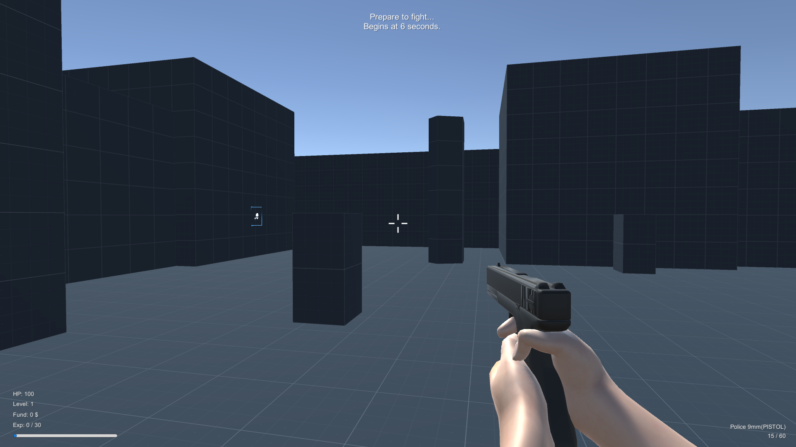
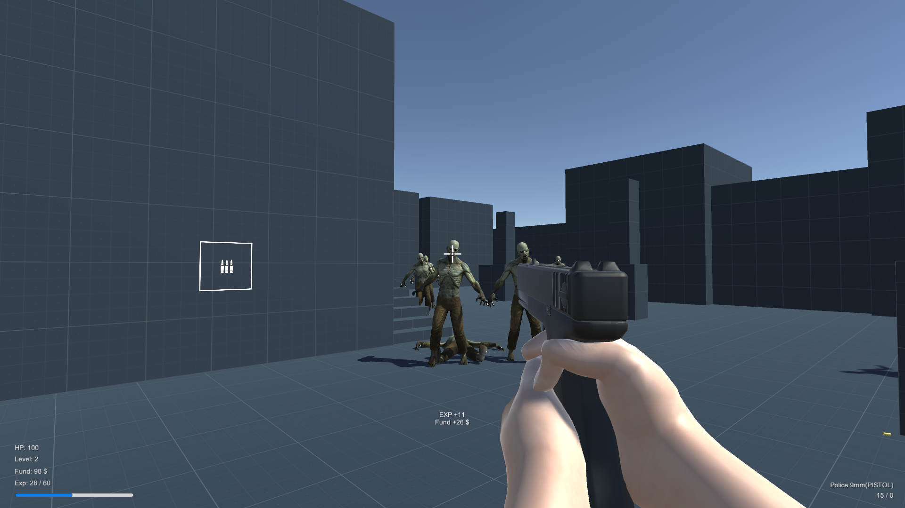
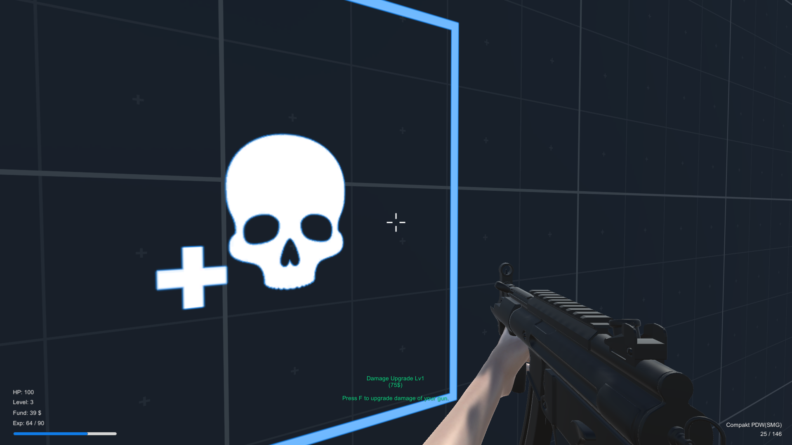
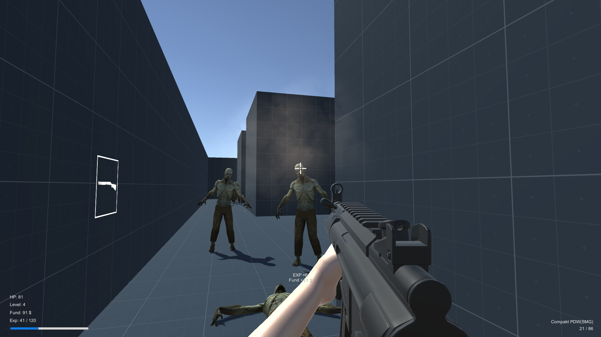

# Unity Zombie Defence FPS Example
This is the example of zombie defence fps game. Kill the zombies to obtain the cash and upgrade your weapon or buy powerful weapons!

Live Demo: [http://modernator.me:5001/](http://modernator.me:5001/)

## Screenshots

## Features
- Extended Standard FPSController: Recoil, Fixing Jump related glitches
- Weapon Sway, Weapon Bobbing
- Endless Zombie offense
- Used Unity's NavMeshAgent for Path finding
- Weapon Buying System
- Weapon Upgrading System
- Raycast Shooting System(Feat. Shotgun)
- Raycast Environment interaction(Shops)
- Global Asset managers (Prefab/Sprite/Sound/Globalsound Managers)
- All models were made and rigified from Blender(Except zombie prefab from Asset store)

## Why it has unused "multiplayed" related scripts?
Because I want to make this game online, but I gave up. I realized that I need more study about them, but some of the script can be useful for later use.
That's because I remained unusing network related resources.

## Control
- WASD: Basic movements
- R: Reloading
- M1/Ctrl: Fire
- M2: Aiming
- L-Shift: Sprinting

## Gameplay rule
- You start with Police 9mm pistol.
- After 10 seconds you entered the game, zombies will spawn and it keeps going on until you are dead.
- Killing a zombie gives you some cash and experience.
- Collect the cash and buy new gun, or upgrade them, or buy some ammunition.
- It's endless survival game. Enemies are getting stronger and stronger, also gives more funds and exps.

## Rules and Tips
- Experience is useless system. Just ignore it.
- Each weapon has own upgrade factors and different upgrade cost & ammo cost. Spend it wisely.
- Upgrading weapon has limitation. You can only upgrade to LV10 of each.
- While you are aiming, you gain much more high accuracy, but you lost some speed.
- All headshot gives 3x damage. Try to aim the head!
- Every 50 seconds, enemy will getting tough and stronger. Don't forget to upgrade your weapon damage or get some more powerful weapon!
- Weapon upgrade is not sharing for all weapons. Don't confuse.
- Zombie has an "attackable" angle sight. If you are get closed enough to being attacked, but zombie is not facing to you directly, he can't attack you and try to rotate to face you.
- Reduce recoil upgrade helps you shoot enemy more precisely. This upgrade especially good for automatic weapons, like MP5K and AKM.
- M870(Defender Shotgun) fires 8 bullets once, so it has great benefit of damage upgrade. You can easily kill the zombie with single headshot for a long time, without damage upgrade.
- AKM(Stov Rifle) is most powerful weapon in this game, also it's most expensive. It has 30 round magazine, and easily kill the zombie with 2-3 headshot. But it has huge firing recoil, so you should buy some reduce recoil upgrades.
- MP5K(Compakt PDW) is most cheapest primary weapon. It has 25 magazine and has very high fire rate, but also has weakness damage in this game. It has cheap ammo cost and upgrade cost, but I'm not recommend to use this weapon for a long time.
- Police 9mm Pistol(Glock) is starting weapon and it's only one secondary weapon. It means any weapon you buy, you still can use pistol. Pistol has cheapest ammo price and upgrade cost.

## Bugs & Improvements
Please write the issue on the github page when you found bugs. But I have no plan to improve this game, because this game is just for demonstration.
